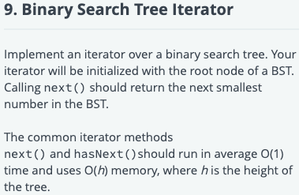

```python
class TreeNode:
    def __init__(self, x):
        self.val = x
        self.left = self.right = None


def insert(val, root):
    if val < root.val:
        if root.left is None:
            root.left = TreeNode(val)
        else:
            insert(val, root.left)
    else:
        if root.right is None:
            root.right = TreeNode(val)
        else:
            insert(val, root.right)


def input_bst():
    input_values = map(int, input().split())
    num_nodes = next(input_values)
    if num_nodes == 0:
        return None

    root = TreeNode(next(input_values))

    for i in range(1, num_nodes):
        insert(next(input_values), root)

    return root


"""
class TreeNode:
    def __init__(self, x):
        self.val = x
        self.left = self.right = None
"""
'''
in-order traversal: recursive
'''

class BSTIterator(object):
    def __init__(self, root):
        """
        :type root: TreeNode
        """
        
        
    def has_next(self):
        """
        :rtype: bool
        """
        

    def next(self):
        """
        :rtype: int
        """

root = input_bst()
iter = BSTIterator(root)
while iter.has_next():
    print(iter.next())

```

