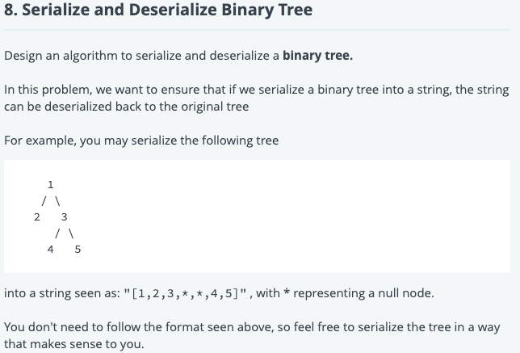

```python
class TreeNode:
    def __init__(self, x):
        self.val = x
        self.left = self.right = None


def insert(val, root):
    if val < root.val:
        if root.left is None:
            root.left = TreeNode(val)
        else:
            insert(val, root.left)
    else:
        if root.right is None:
            root.right = TreeNode(val)
        else:
            insert(val, root.right)


def input_bst():
    input_values = map(int, input().split())
    num_nodes = next(input_values)
    if num_nodes == 0:
        return None

    root = TreeNode(next(input_values))

    for i in range(1, num_nodes):
        insert(next(input_values), root)

    return root


def description(root):
    if root is None:
        return " "

    queue = []

    output = str(root.val)
    queue.append(root)
    cursor = 0

    while cursor < len(queue):
        node = queue[cursor]
        cursor += 1

        if node.left is not None:
            output += " " + str(node.left.val)
            queue.append(node.left)

        if node.right is not None:
            output += " " + str(node.right.val)
            queue.append(node.right)

    return output


"""
class TreeNode:
    def __init__(self, x):
        self.val = x
        self.left = self.right = None
"""
def serialize(root):
    """Encodes a tree to a single string.

    :type root: TreeNode
    :rtype: str
    """
        

def deserialize(data):
    """Decodes your encoded data to tree.

    :type data: str
    :rtype: TreeNode
    """

root = input_bst()
new_root = deserialize(serialize(root))
print(description(new_root))

```


mycode

```python
#!/usr/bin/env python

class TreeNode:
    def __init__(self, x):
        self.val = x
        self.left = self.right = None


def insert(val, root):
    if val < root.val:
        if root.left is None:
            root.left = TreeNode(val)
        else:
            insert(val, root.left)
    else:
        if root.right is None:
            root.right = TreeNode(val)
        else:
            insert(val, root.right)


def input_bst():
    input_values = map(int, input().split())
    num_nodes = next(input_values)
    if num_nodes == 0:
        return None

    root = TreeNode(next(input_values))

    for i in range(1, num_nodes):
        insert(next(input_values), root)

    return root


def description(root):
    if root is None:
        return " "

    queue = []

    output = str(root.val)
    queue.append(root)
    cursor = 0

    while cursor < len(queue):
        node = queue[cursor]
        cursor += 1

        if node.left is not None:
            output += " " + str(node.left.val)
            queue.append(node.left)

        if node.right is not None:
            output += " " + str(node.right.val)
            queue.append(node.right)

    return output


"""
class TreeNode:
    def __init__(self, x):
        self.val = x
        self.left = self.right = None
"""
from collections import deque


def serialize(root):
    """Encodes a tree to a single string.

    :type root: TreeNode
    :rtype: str
    """
    queue = deque()
    queue.append(root)
    res = []
    while queue:
        tmp = queue.popleft()
        res.append(tmp.val)
        if tmp.left: 
            queue.append(tmp.left)
        else: 
            res.append('*')
        if tmp.right: 
            queue.append(tmp.right)
        else:
            res.append('*')
    return str(res)

def deserialize(data):
    """Decodes your encoded data to tree.

    :type data: str
    :rtype: TreeNode
    """
    res = data.strip('[]').split(',')
    res = [int(x) for x in res]
    
    if not res: return None
    i = 1
    level = 1
    root = TreeNode(res[0])
    curr = root
    queue = deque()
    queue.append(root)
    while queue and i < len(res):
        tmp = queue.popleft()
        left_node = TreeNode(res[i])
        right_node = TreeNode(res[i+1])
        tmp.left = left_node
        tmp.right = right_node
        queue.append(left_node)
        queue.append(right_node)
        i += 2
    
    return root

root = input_bst()
new_root = deserialize(serialize(root))
print(description(new_root))

```

