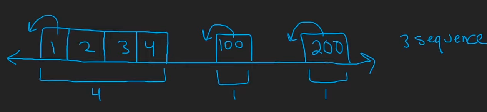

# Longest Consecutive Sequence

https://leetcode.com/problems/longest-consecutive-sequence/description/

Given an unsorted array of integers `nums`, return *the length of the longest consecutive elements sequence.*

You must write an algorithm that runs in `O(n)` time.

 

**Example 1:**

```
Input: nums = [100,4,200,1,3,2]
Output: 4
Explanation: The longest consecutive elements sequence is [1, 2, 3, 4]. Therefore its length is 4.
```

**Example 2:**

```
Input: nums = [0,3,7,2,5,8,4,6,0,1]
Output: 9
```

**Example 3:**

```
Input: nums = [1,0,1,2]
Output: 3
```

 

**Constraints:**

- `0 <= nums.length <= 105`
- `-109 <= nums[i] <= 109`


Reflections:

1. count length in one direction


## Solution

```python
class Solution:
    def longestConsecutive(self, nums: List[int]) -> int:
        if not nums: return 0
        seen = set(nums)
        res = 1

        for num in seen:
            if num-1 in seen: continue
            else:
                cnt = 1
                num += 1
                while num in seen:
                    cnt += 1
                    num += 1
                res = max(res, cnt)
        
        return res
```

TC: O(n)

SC: O(n)

