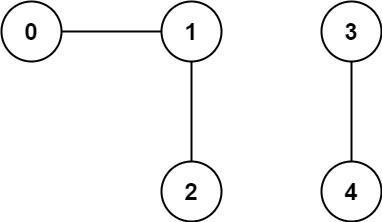

### Number of Connected Components in an Undirected Graph

https://leetcode.com/problems/number-of-connected-components-in-an-undirected-graph/description/

You have a graph of `n` nodes. You are given an integer `n` and an array `edges` where `edges[i] = [ai, bi]` indicates that there is an edge between `ai` and `bi` in the graph.

Return *the number of connected components in the graph*.

 

**Example 1:**



```
Input: n = 5, edges = [[0,1],[1,2],[3,4]]
Output: 2
```

**Example 2:**


```
Input: n = 5, edges = [[0,1],[1,2],[2,3],[3,4]]
Output: 1
```

 

**Constraints:**

- `1 <= n <= 2000`
- `1 <= edges.length <= 5000`
- `edges[i].length == 2`
- `0 <= ai <= bi < n`
- `ai != bi`
- There are no repeated edges.


**Reflections**:

- We can do either dfs/bfs to traverse the graph, or use DSU (disjoint-set-union) to count number of connected components


## Solution: dfs

```python
class Solution:
    def countComponents(self, n: int, edges: List[List[int]]) -> int:
        visited = set()
        adj = {i: [] for i in range(n)}
        for a, b in edges:
            adj[a].append(b)
            adj[b].append(a)
        res = 0

        def dfs(root):
            if root in visited: return False

            visited.add(root)
            for neighbor in adj[root]:
                dfs(neighbor)
        
            return True

        for i in range(n):
            if dfs(i):
                res += 1
            
        return res
```

TC: O(V+E)

SC: O(V+E)


## Solution: bfs

```python
from collections import deque
class Solution:
    def countComponents(self, n: int, edges: List[List[int]]) -> int:
        adj = {i: [] for i in range(n)}
        for a, b in edges:
            adj[a].append(b)
            adj[b].append(a)
        visited = [False] * n

        def bfs(root) -> int:
            if visited[root]: return 0
            dq = deque([root])

            while dq:
                curr = dq.popleft()
                for neighbor in adj[curr]:
                    if not visited[neighbor]:
                        visited[neighbor] = True
                        dq.append(neighbor)
            return 1
        
        res = 0
        for i in range(n):
            res += bfs(i)
        
        return res
```

TC: O(V+E)

SC: O(V+E)


## Solution: Union-find

```python
class Solution:
    def countComponents(self, n: int, edges: List[List[int]]) -> int:
        par = list(range(n))
        rank = [1] * n

        def find(node):
            curr = node
            while curr != par[curr]:
                par[curr] = par[par[curr]] # path compression
                curr = par[curr]
            
            return curr

        def union(v1, v2) -> int:
            p1 = find(v1)
            p2 = find(v2)

            if p1 == p2: return 0
            else:
                if rank[p1] >= rank[p2]:
                    par[p2] = p1
                    rank[p1] += rank[p2]

                else:
                    par[p1] = p2
                    rank[p2] += rank[p1]
            return 1
        
        res = n
        for a, b in edges:
            res -= union(a, b)
        
        return res
```

The key is to have a parent variable for getting the parent of each node, and also the rank

TC: O(n+m)

SC: O(n)

n: number of nodes

m: number of edges