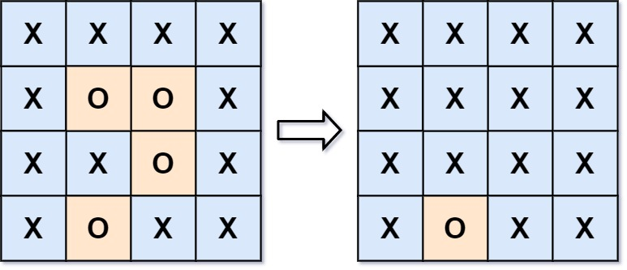

# Surrounded Regions

https://leetcode.com/problems/surrounded-regions/description/

You are given an `m x n` matrix `board` containing **letters** `'X'` and `'O'`, **capture regions** that are **surrounded**:

- **Connect**: A cell is connected to adjacent cells horizontally or vertically.
- **Region**: To form a region **connect every** `'O'` cell.
- **Surround**: The region is surrounded with `'X'` cells if you can **connect the region** with `'X'` cells and none of the region cells are on the edge of the `board`.

To capture a **surrounded region**, replace all `'O'`s with `'X'`s **in-place** within the original board. You do not need to return anything.

 

**Example 1:**

**Input:** board = [["X","X","X","X"],["X","O","O","X"],["X","X","O","X"],["X","O","X","X"]]

**Output:** [["X","X","X","X"],["X","X","X","X"],["X","X","X","X"],["X","O","X","X"]]

**Explanation:**



In the above diagram, the bottom region is not captured because it is on the edge of the board and cannot be surrounded.

**Example 2:**

**Input:** board = [["X"]]

**Output:** [["X"]]

 

**Constraints:**

- `m == board.length`
- `n == board[i].length`
- `1 <= m, n <= 200`
- `board[i][j]` is `'X'` or `'O'`.


**Reflections**:

- reverse thinking: **capture regions** that are **surrounded** == **capture everything except regions** that are **unsurrounded** -> start with "O" on the border
- Can store visited in place rather than using hashset 


## Solution: dfs

```python
class Solution:
    def solve(self, board: List[List[str]]) -> None:
        """
        Do not return anything, modify board in-place instead.
        """
        ROWS, COLS = len(board), len(board[0])
        def dfs(r, c):
            if ((r < 0 or r >= ROWS) or
                (c < 0 or c >= COLS) or 
                board[r][c] != "O"):
                return
            board[r][c] = 'V'
            for row, col in [[r-1, c], [r+1, c], [r, c-1], [r, c+1]]:
                dfs(row, col)
        
        for r in range(ROWS):
            if board[r][0] == 'O':
                dfs(r, 0)
            if board[r][COLS-1] == 'O':
                dfs(r, COLS-1)
        
        for c in range(COLS):
            if board[0][c] == 'O':
                dfs(0, c)
            if board[ROWS-1][c] == 'O':
                dfs(ROWS-1, c)
        
        for r in range(ROWS):
            for c in range(COLS):
                if board[r][c] == 'O':
                    board[r][c] = 'X'
                if board[r][c] == 'V':
                    board[r][c] = 'O'
```

TC: O(m * n)

SC: O(m * n), or O(1) since modifying in-place