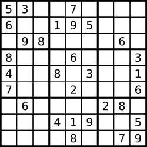
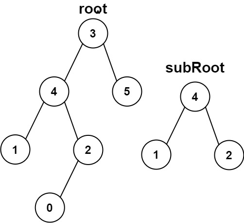

# Problem Collections

**Table of Contents**

- [Problem Collections](#problem-collections)
  - [Arrays and Hashing](#arrays-and-hashing)
    - [Group Anagrams](#group-anagrams)
    - [Top K Frequent Elements](#top-k-frequent-elements)
    - [Encode and Decode Strings](#encode-and-decode-strings)
    - [Product of Array Except Self](#product-of-array-except-self)
    - [Valid Sudoku](#valid-sudoku)
    - [Contains Duplicate](#contains-duplicate)
    - [Longest Consecutive Sequence](#longest-consecutive-sequence)
    - [Valid Anagram](#valid-anagram)
    - [Two Sum](#two-sum)
  - [Two Pointers](#two-pointers)
    - [Two Sum II - Input Array Is Sorted](#two-sum-ii---input-array-is-sorted)
    - [3Sum](#3sum)
    - [Container With Most Water](#container-with-most-water)
    - [Trapping Rain Water](#trapping-rain-water)
    - [Valid Palindrome](#valid-palindrome)
    - [Count Pairs Whose Sum is Less than Target](#count-pairs-whose-sum-is-less-than-target)
    - [Count the Number of Fair Pairs](#count-the-number-of-fair-pairs)
  - [Stack](#stack)
    - [Min Stack](#min-stack)
    - [Evaluate Reverse Polish Notation](#evaluate-reverse-polish-notation)
    - [Generate Parentheses](#generate-parentheses)
    - [Daily Temperatures](#daily-temperatures)
    - [Valid Parentheses](#valid-parentheses)
    - [Car Fleet](#car-fleet)
    - [Largest Rectangle in Histogram](#largest-rectangle-in-histogram)
  - [Binary Search](#binary-search)
    - [Koko Eating Bananas](#koko-eating-bananas)
    - [Binary Search](#binary-search-1)
    - [Search a 2D Matrix](#search-a-2d-matrix)
    - [Find Minimum in Rotated Sorted Array](#find-minimum-in-rotated-sorted-array)
    - [Search in Rotated Sorted Array](#search-in-rotated-sorted-array)
    - [Time Based Key-Value Store](#time-based-key-value-store)
    - [Median of Two Sorted Arrays](#median-of-two-sorted-arrays)
  - [Sliding Window](#sliding-window)
    - [Best Time to Buy and Sell Stock](#best-time-to-buy-and-sell-stock)
    - [Longest Substring Without Repeating Characters](#longest-substring-without-repeating-characters)
    - [Longest Repeating Character Replacement](#longest-repeating-character-replacement)
    - [Minimum Window Substring](#minimum-window-substring)
    - [Sliding Window Maximum](#sliding-window-maximum)
  - [Linked List](#linked-list)
    - [Reverse Linked List](#reverse-linked-list)
    - [Merge Two Sorted Lists](#merge-two-sorted-lists)
    - [Linked List Cycle](#linked-list-cycle)
    - [Reorder List](#reorder-list)
    - [Remove Nth Node From End of List](#remove-nth-node-from-end-of-list)
    - [Copy List with Random Pointer](#copy-list-with-random-pointer)
    - [Find the Duplicate Number](#find-the-duplicate-number)
    - [LRU Cache](#lru-cache)
    - [Merge k Sorted Lists](#merge-k-sorted-lists)
    - [Reverse Nodes in k-Group](#reverse-nodes-in-k-group)
  - [Tree](#tree)
    - [Invert Binary Tree](#invert-binary-tree)
    - [Maximum Depth of Binary Tree](#maximum-depth-of-binary-tree)
    - [Diameter of Binary Tree](#diameter-of-binary-tree)
    - [Balanced Binary Tree](#balanced-binary-tree)
    - [Same Tree](#same-tree)
    - [Subtree of Another Tree](#subtree-of-another-tree)
    - [Lowest Common Ancestor of a Binary Search Tree](#lowest-common-ancestor-of-a-binary-search-tree)
    - [Binary Tree Level Order Traversal](#binary-tree-level-order-traversal)
    - [Binary Tree Right Side View](#binary-tree-right-side-view)
    - [Count Good Nodes in Binary Tree](#count-good-nodes-in-binary-tree)
    - [Validate Binary Search Tree](#validate-binary-search-tree)
    - [Kth Smallest Element in a BST](#kth-smallest-element-in-a-bst)
    - [Construct Binary Tree from Preorder and Inorder Traversal](#construct-binary-tree-from-preorder-and-inorder-traversal)
    - [Binary Tree Maximum Path Sum](#binary-tree-maximum-path-sum)
    - [Serialize and Deserialize Binary Tree](#serialize-and-deserialize-binary-tree)
  - [Heap](#heap)
    - [Kth Largest Element in a Stream](#kth-largest-element-in-a-stream)
    - [Last Stone Weight](#last-stone-weight)
    - [K Closest Points to Origin](#k-closest-points-to-origin)
    - [Task Scheduler](#task-scheduler)
    - [Design Twitter](#design-twitter)
    - [Find Median from Data Stream](#find-median-from-data-stream)
  - [Backtracking](#backtracking)
    - [Subsets](#subsets)
    - [Combination Sum](#combination-sum)
    - [Combination Sum II](#combination-sum-ii)
    - [Permutations](#permutations)
    - [Subsets II](#subsets-ii)
    - [Word Search](#word-search)
    - [Palindrome Partitioning](#palindrome-partitioning)
    - [Letter Combinations of a Phone Number](#letter-combinations-of-a-phone-number)
    - [N-Queens](#n-queens)
  - [Graph](#graph)
    - [Number of Islands](#number-of-islands)


## Arrays and Hashing

### Group Anagrams

https://leetcode.com/problems/group-anagrams/description/

Given an array of strings `strs`, group the anagrams together. You can return the answer in **any order**.

 

**Example 1:**

**Input:** strs = ["eat","tea","tan","ate","nat","bat"]

**Output:** [["bat"],["nat","tan"],["ate","eat","tea"]]

**Explanation:**

- There is no string in strs that can be rearranged to form `"bat"`.
- The strings `"nat"` and `"tan"` are anagrams as they can be rearranged to form each other.
- The strings `"ate"`, `"eat"`, and `"tea"` are anagrams as they can be rearranged to form each other.

**Example 2:**

**Input:** strs = [""]

**Output:** [[""]]

**Example 3:**

**Input:** strs = ["a"]

**Output:** [["a"]]

 

**Constraints:**

- `1 <= strs.length <= 104`
- `0 <= strs[i].length <= 100`
- `strs[i]` consists of lowercase English letters.

---

### Top K Frequent Elements

https://leetcode.com/problems/top-k-frequent-elements/description/

Given an integer array `nums` and an integer `k`, return *the* `k` *most frequent elements*. You may return the answer in **any order**.

 

**Example 1:**

```
Input: nums = [1,1,1,2,2,3], k = 2
Output: [1,2]
```

**Example 2:**

```
Input: nums = [1], k = 1
Output: [1]
```

 

**Constraints:**

- `1 <= nums.length <= 105`
- `-104 <= nums[i] <= 104`
- `k` is in the range `[1, the number of unique elements in the array]`.
- It is **guaranteed** that the answer is **unique**.

 

**Follow up:** Your algorithm's time complexity must be better than `O(n log n)`, where n is the array's size.

---

### Encode and Decode Strings

https://leetcode.com/problems/encode-and-decode-strings/description/

Design an algorithm to encode **a list of strings** to **a string**. The encoded string is then sent over the network and is decoded back to the original list of strings.

Machine 1 (sender) has the function:

```
string encode(vector<string> strs) {
  // ... your code
  return encoded_string;
}
```

Machine 2 (receiver) has the function:

```
vector<string> decode(string s) {
  //... your code
  return strs;
}
```

So Machine 1 does:

```
string encoded_string = encode(strs);
```

and Machine 2 does:

```
vector<string> strs2 = decode(encoded_string);
```

`strs2` in Machine 2 should be the same as `strs` in Machine 1.

Implement the `encode` and `decode` methods.

You are not allowed to solve the problem using any serialize methods (such as `eval`).

 

**Example 1:**

```
Input: dummy_input = ["Hello","World"]
Output: ["Hello","World"]
Explanation:
Machine 1:
Codec encoder = new Codec();
String msg = encoder.encode(strs);
Machine 1 ---msg---> Machine 2

Machine 2:
Codec decoder = new Codec();
String[] strs = decoder.decode(msg);
```

**Example 2:**

```
Input: dummy_input = [""]
Output: [""]
```

 

**Constraints:**

- `1 <= strs.length <= 200`
- `0 <= strs[i].length <= 200`
- `strs[i]` contains any possible characters out of `256` valid ASCII characters.

 

**Follow up:** Could you write a generalized algorithm to work on any possible set of characters?

---

### Product of Array Except Self

https://leetcode.com/problems/product-of-array-except-self/description/

Given an integer array `nums`, return *an array* `answer` *such that* `answer[i]` *is equal to the product of all the elements of* `nums` *except* `nums[i]`.

The product of any prefix or suffix of `nums` is **guaranteed** to fit in a **32-bit** integer.

You must write an algorithm that runs in `O(n)` time and without using the division operation.

 

**Example 1:**

```
Input: nums = [1,2,3,4]
Output: [24,12,8,6]
```

**Example 2:**

```
Input: nums = [-1,1,0,-3,3]
Output: [0,0,9,0,0]
```

 

**Constraints:**

- `2 <= nums.length <= 105`
- `-30 <= nums[i] <= 30`
- The input is generated such that `answer[i]` is **guaranteed** to fit in a **32-bit** integer.

 

**Follow up:** Can you solve the problem in `O(1)` extra space complexity? (The output array **does not** count as extra space for space complexity analysis.)

---

### Valid Sudoku

https://leetcode.com/problems/valid-sudoku/description/

Determine if a `9 x 9` Sudoku board is valid. Only the filled cells need to be validated **according to the following rules**:

1. Each row must contain the digits `1-9` without repetition.
2. Each column must contain the digits `1-9` without repetition.
3. Each of the nine `3 x 3` sub-boxes of the grid must contain the digits `1-9` without repetition.

**Note:**

- A Sudoku board (partially filled) could be valid but is not necessarily solvable.
- Only the filled cells need to be validated according to the mentioned rules.

 

**Example 1:**



```
Input: board = 
[["5","3",".",".","7",".",".",".","."]
,["6",".",".","1","9","5",".",".","."]
,[".","9","8",".",".",".",".","6","."]
,["8",".",".",".","6",".",".",".","3"]
,["4",".",".","8",".","3",".",".","1"]
,["7",".",".",".","2",".",".",".","6"]
,[".","6",".",".",".",".","2","8","."]
,[".",".",".","4","1","9",".",".","5"]
,[".",".",".",".","8",".",".","7","9"]]
Output: true
```

**Example 2:**

```
Input: board = 
[["8","3",".",".","7",".",".",".","."]
,["6",".",".","1","9","5",".",".","."]
,[".","9","8",".",".",".",".","6","."]
,["8",".",".",".","6",".",".",".","3"]
,["4",".",".","8",".","3",".",".","1"]
,["7",".",".",".","2",".",".",".","6"]
,[".","6",".",".",".",".","2","8","."]
,[".",".",".","4","1","9",".",".","5"]
,[".",".",".",".","8",".",".","7","9"]]
Output: false
Explanation: Same as Example 1, except with the 5 in the top left corner being modified to 8. Since there are two 8's in the top left 3x3 sub-box, it is invalid.
```

 

**Constraints:**

- `board.length == 9`
- `board[i].length == 9`
- `board[i][j]` is a digit `1-9` or `'.'`.

---

### Contains Duplicate

https://leetcode.com/problems/contains-duplicate/description/

Given an integer array `nums`, return `true` if any value appears **at least twice** in the array, and return `false` if every element is distinct.

 

**Example 1:**

**Input:** nums = [1,2,3,1]

**Output:** true

**Explanation:**

The element 1 occurs at the indices 0 and 3.

**Example 2:**

**Input:** nums = [1,2,3,4]

**Output:** false

**Explanation:**

All elements are distinct.

**Example 3:**

**Input:** nums = [1,1,1,3,3,4,3,2,4,2]

**Output:** true

 

**Constraints:**

- `1 <= nums.length <= 105`
- `-109 <= nums[i] <= 109`

---

### Longest Consecutive Sequence

https://leetcode.com/problems/longest-consecutive-sequence/description/

Given an unsorted array of integers `nums`, return *the length of the longest consecutive elements sequence.*

You must write an algorithm that runs in `O(n)` time.

 

**Example 1:**

```
Input: nums = [100,4,200,1,3,2]
Output: 4
Explanation: The longest consecutive elements sequence is [1, 2, 3, 4]. Therefore its length is 4.
```

**Example 2:**

```
Input: nums = [0,3,7,2,5,8,4,6,0,1]
Output: 9
```

**Example 3:**

```
Input: nums = [1,0,1,2]
Output: 3
```

 

**Constraints:**

- `0 <= nums.length <= 105`
- `-109 <= nums[i] <= 109`

---

### Valid Anagram

https://leetcode.com/problems/valid-anagram/description/

Given two strings `s` and `t`, return `true` if `t` is an anagram of `s`, and `false` otherwise.

 

**Example 1:**

**Input:** s = "anagram", t = "nagaram"

**Output:** true

**Example 2:**

**Input:** s = "rat", t = "car"

**Output:** false

 

**Constraints:**

- `1 <= s.length, t.length <= 5 * 104`
- `s` and `t` consist of lowercase English letters.

 

**Follow up:** What if the inputs contain Unicode characters? How would you adapt your solution to such a case?

---

### Two Sum

https://leetcode.com/problems/two-sum/description/

Given an array of integers `nums` and an integer `target`, return *indices of the two numbers such that they add up to `target`*.

You may assume that each input would have ***exactly\* one solution**, and you may not use the *same* element twice.

You can return the answer in any order.

 

**Example 1:**

```
Input: nums = [2,7,11,15], target = 9
Output: [0,1]
Explanation: Because nums[0] + nums[1] == 9, we return [0, 1].
```

**Example 2:**

```
Input: nums = [3,2,4], target = 6
Output: [1,2]
```

**Example 3:**

```
Input: nums = [3,3], target = 6
Output: [0,1]
```

 

**Constraints:**

- `2 <= nums.length <= 104`
- `-109 <= nums[i] <= 109`
- `-109 <= target <= 109`
- **Only one valid answer exists.**

 

**Follow-up:** Can you come up with an algorithm that is less than `O(n2)` time complexity?


## Two Pointers

### Two Sum II - Input Array Is Sorted

https://leetcode.com/problems/two-sum-ii-input-array-is-sorted/description/

Given a **1-indexed** array of integers `numbers` that is already ***sorted in non-decreasing order***, find two numbers such that they add up to a specific `target` number. Let these two numbers be `numbers[index1]` and `numbers[index2]` where `1 <= index1 < index2 <= numbers.length`.

Return *the indices of the two numbers,* `index1` *and* `index2`*, **added by one** as an integer array* `[index1, index2]` *of length 2.*

The tests are generated such that there is **exactly one solution**. You **may not** use the same element twice.

Your solution must use only constant extra space.

 

**Example 1:**

```
Input: numbers = [2,7,11,15], target = 9
Output: [1,2]
Explanation: The sum of 2 and 7 is 9. Therefore, index1 = 1, index2 = 2. We return [1, 2].
```

**Example 2:**

```
Input: numbers = [2,3,4], target = 6
Output: [1,3]
Explanation: The sum of 2 and 4 is 6. Therefore index1 = 1, index2 = 3. We return [1, 3].
```

**Example 3:**

```
Input: numbers = [-1,0], target = -1
Output: [1,2]
Explanation: The sum of -1 and 0 is -1. Therefore index1 = 1, index2 = 2. We return [1, 2].
```

 

**Constraints:**

- `2 <= numbers.length <= 3 * 104`
- `-1000 <= numbers[i] <= 1000`
- `numbers` is sorted in **non-decreasing order**.
- `-1000 <= target <= 1000`
- The tests are generated such that there is **exactly one solution**.

---

### 3Sum

https://leetcode.com/problems/3sum/description/

Given an integer array nums, return all the triplets `[nums[i], nums[j], nums[k]]` such that `i != j`, `i != k`, and `j != k`, and `nums[i] + nums[j] + nums[k] == 0`.

Notice that the solution set must not contain duplicate triplets.

 

**Example 1:**

```
Input: nums = [-1,0,1,2,-1,-4]
Output: [[-1,-1,2],[-1,0,1]]
Explanation: 
nums[0] + nums[1] + nums[2] = (-1) + 0 + 1 = 0.
nums[1] + nums[2] + nums[4] = 0 + 1 + (-1) = 0.
nums[0] + nums[3] + nums[4] = (-1) + 2 + (-1) = 0.
The distinct triplets are [-1,0,1] and [-1,-1,2].
Notice that the order of the output and the order of the triplets does not matter.
```

**Example 2:**

```
Input: nums = [0,1,1]
Output: []
Explanation: The only possible triplet does not sum up to 0.
```

**Example 3:**

```
Input: nums = [0,0,0]
Output: [[0,0,0]]
Explanation: The only possible triplet sums up to 0.
```

 

**Constraints:**

- `3 <= nums.length <= 3000`
- `-105 <= nums[i] <= 105`


**Reflections**:

1. Be aware that output does not contain duplicate triplet -> how to update index when hitting target and the starting num

---

### Container With Most Water

You are given an integer array `height` of length `n`. There are `n` vertical lines drawn such that the two endpoints of the `ith` line are `(i, 0)` and `(i, height[i])`.

Find two lines that together with the x-axis form a container, such that the container contains the most water.

Return *the maximum amount of water a container can store*.

**Notice** that you may not slant the container.

 

**Example 1:**


```
Input: height = [1,8,6,2,5,4,8,3,7]
Output: 49
Explanation: The above vertical lines are represented by array [1,8,6,2,5,4,8,3,7]. In this case, the max area of water (blue section) the container can contain is 49.
```

**Example 2:**

```
Input: height = [1,1]
Output: 1
```

 

**Constraints:**

- `n == height.length`
- `2 <= n <= 105`
- `0 <= height[i] <= 104`

---

### Trapping Rain Water

https://leetcode.com/problems/trapping-rain-water/description/

Given `n` non-negative integers representing an elevation map where the width of each bar is `1`, compute how much water it can trap after raining.

 

**Example 1:**


```
Input: height = [0,1,0,2,1,0,1,3,2,1,2,1]
Output: 6
Explanation: The above elevation map (black section) is represented by array [0,1,0,2,1,0,1,3,2,1,2,1]. In this case, 6 units of rain water (blue section) are being trapped.
```

**Example 2:**

```
Input: height = [4,2,0,3,2,5]
Output: 9
```

 

**Constraints:**

- `n == height.length`
- `1 <= n <= 2 * 104`
- `0 <= height[i] <= 105`

---

### Valid Palindrome

https://leetcode.com/problems/valid-palindrome/description/
A phrase is a **palindrome** if, after converting all uppercase letters into lowercase letters and removing all non-alphanumeric characters, it reads the same forward and backward. Alphanumeric characters include letters and numbers.

Given a string `s`, return `true` *if it is a **palindrome**, or* `false` *otherwise*.

 

**Example 1:**

```
Input: s = "A man, a plan, a canal: Panama"
Output: true
Explanation: "amanaplanacanalpanama" is a palindrome.
```

**Example 2:**

```
Input: s = "race a car"
Output: false
Explanation: "raceacar" is not a palindrome.
```

**Example 3:**

```
Input: s = " "
Output: true
Explanation: s is an empty string "" after removing non-alphanumeric characters.
Since an empty string reads the same forward and backward, it is a palindrome.
```

 

**Constraints:**

- `1 <= s.length <= 2 * 105`
- `s` consists only of printable ASCII characters.

---

### Count Pairs Whose Sum is Less than Target

https://leetcode.com/problems/count-pairs-whose-sum-is-less-than-target/description/

Given a **0-indexed** integer array `nums` of length `n` and an integer `target`, return *the number of pairs* `(i, j)` *where* `0 <= i < j < n` *and* `nums[i] + nums[j] < target`.

 

**Example 1:**

```
Input: nums = [-1,1,2,3,1], target = 2
Output: 3
Explanation: There are 3 pairs of indices that satisfy the conditions in the statement:
- (0, 1) since 0 < 1 and nums[0] + nums[1] = 0 < target
- (0, 2) since 0 < 2 and nums[0] + nums[2] = 1 < target 
- (0, 4) since 0 < 4 and nums[0] + nums[4] = 0 < target
Note that (0, 3) is not counted since nums[0] + nums[3] is not strictly less than the target.
```

**Example 2:**

```
Input: nums = [-6,2,5,-2,-7,-1,3], target = -2
Output: 10
Explanation: There are 10 pairs of indices that satisfy the conditions in the statement:
- (0, 1) since 0 < 1 and nums[0] + nums[1] = -4 < target
- (0, 3) since 0 < 3 and nums[0] + nums[3] = -8 < target
- (0, 4) since 0 < 4 and nums[0] + nums[4] = -13 < target
- (0, 5) since 0 < 5 and nums[0] + nums[5] = -7 < target
- (0, 6) since 0 < 6 and nums[0] + nums[6] = -3 < target
- (1, 4) since 1 < 4 and nums[1] + nums[4] = -5 < target
- (3, 4) since 3 < 4 and nums[3] + nums[4] = -9 < target
- (3, 5) since 3 < 5 and nums[3] + nums[5] = -3 < target
- (4, 5) since 4 < 5 and nums[4] + nums[5] = -8 < target
- (4, 6) since 4 < 6 and nums[4] + nums[6] = -4 < target
```

 

**Constraints:**

- `1 <= nums.length == n <= 50`
- `-50 <= nums[i], target <= 50`

---

### Count the Number of Fair Pairs

https://leetcode.com/problems/count-the-number-of-fair-pairs/description/

Given a **0-indexed** integer array `nums` of size `n` and two integers `lower` and `upper`, return *the number of fair pairs*.

A pair `(i, j)` is **fair** if:

- `0 <= i < j < n`, and
- `lower <= nums[i] + nums[j] <= upper`

 

**Example 1:**

```
Input: nums = [0,1,7,4,4,5], lower = 3, upper = 6
Output: 6
Explanation: There are 6 fair pairs: (0,3), (0,4), (0,5), (1,3), (1,4), and (1,5).
```

**Example 2:**

```
Input: nums = [1,7,9,2,5], lower = 11, upper = 11
Output: 1
Explanation: There is a single fair pair: (2,3).
```

 

**Constraints:**

- `1 <= nums.length <= 105`
- `nums.length == n`
- `-109 <= nums[i] <= 109`
- `-109 <= lower <= upper <= 109`

---

## Stack

### Min Stack

https://leetcode.com/problems/min-stack/description/

Design a stack that supports push, pop, top, and retrieving the minimum element in constant time.

Implement the `MinStack` class:

- `MinStack()` initializes the stack object.
- `void push(int val)` pushes the element `val` onto the stack.
- `void pop()` removes the element on the top of the stack.
- `int top()` gets the top element of the stack.
- `int getMin()` retrieves the minimum element in the stack.

You must implement a solution with `O(1)` time complexity for each function.

 

**Example 1:**

```
Input
["MinStack","push","push","push","getMin","pop","top","getMin"]
[[],[-2],[0],[-3],[],[],[],[]]

Output
[null,null,null,null,-3,null,0,-2]

Explanation
MinStack minStack = new MinStack();
minStack.push(-2);
minStack.push(0);
minStack.push(-3);
minStack.getMin(); // return -3
minStack.pop();
minStack.top();    // return 0
minStack.getMin(); // return -2
```

 

**Constraints:**

- `-231 <= val <= 231 - 1`
- Methods `pop`, `top` and `getMin` operations will always be called on **non-empty** stacks.
- At most `3 * 104` calls will be made to `push`, `pop`, `top`, and `getMin`.

---

### Evaluate Reverse Polish Notation

https://leetcode.com/problems/evaluate-reverse-polish-notation/description/

You are given an array of strings `tokens` that represents an arithmetic expression in a [Reverse Polish Notation](http://en.wikipedia.org/wiki/Reverse_Polish_notation).

Evaluate the expression. Return *an integer that represents the value of the expression*.

**Note** that:

- The valid operators are `'+'`, `'-'`, `'*'`, and `'/'`.
- Each operand may be an integer or another expression.
- The division between two integers always **truncates toward zero**.
- There will not be any division by zero.
- The input represents a valid arithmetic expression in a reverse polish notation.
- The answer and all the intermediate calculations can be represented in a **32-bit** integer.

 

**Example 1:**

```
Input: tokens = ["2","1","+","3","*"]
Output: 9
Explanation: ((2 + 1) * 3) = 9
```

**Example 2:**

```
Input: tokens = ["4","13","5","/","+"]
Output: 6
Explanation: (4 + (13 / 5)) = 6
```

**Example 3:**

```
Input: tokens = ["10","6","9","3","+","-11","*","/","*","17","+","5","+"]
Output: 22
Explanation: ((10 * (6 / ((9 + 3) * -11))) + 17) + 5
= ((10 * (6 / (12 * -11))) + 17) + 5
= ((10 * (6 / -132)) + 17) + 5
= ((10 * 0) + 17) + 5
= (0 + 17) + 5
= 17 + 5
= 22
```

 

**Constraints:**

- `1 <= tokens.length <= 104`
- `tokens[i]` is either an operator: `"+"`, `"-"`, `"*"`, or `"/"`, or an integer in the range `[-200, 200]`.

---

### Generate Parentheses

https://leetcode.com/problems/generate-parentheses/description/

Given `n` pairs of parentheses, write a function to *generate all combinations of well-formed parentheses*.

 

**Example 1:**

```
Input: n = 3
Output: ["((()))","(()())","(())()","()(())","()()()"]
```

**Example 2:**

```
Input: n = 1
Output: ["()"]
```

 

**Constraints:**

- `1 <= n <= 8`

---

### Daily Temperatures

https://leetcode.com/problems/daily-temperatures/description/

Given an array of integers `temperatures` represents the daily temperatures, return *an array* `answer` *such that* `answer[i]` *is the number of days you have to wait after the* `ith` *day to get a warmer temperature*. If there is no future day for which this is possible, keep `answer[i] == 0` instead.

 

**Example 1:**

```
Input: temperatures = [73,74,75,71,69,72,76,73]
Output: [1,1,4,2,1,1,0,0]
```

**Example 2:**

```
Input: temperatures = [30,40,50,60]
Output: [1,1,1,0]
```

**Example 3:**

```
Input: temperatures = [30,60,90]
Output: [1,1,0]
```

 

**Constraints:**

- `1 <= temperatures.length <= 105`
- `30 <= temperatures[i] <= 100`

---

### Valid Parentheses

https://leetcode.com/problems/valid-parentheses/description/

Given a string `s` containing just the characters `'('`, `')'`, `'{'`, `'}'`, `'['` and `']'`, determine if the input string is valid.

An input string is valid if:

1. Open brackets must be closed by the same type of brackets.
2. Open brackets must be closed in the correct order.
3. Every close bracket has a corresponding open bracket of the same type.

 

**Example 1:**

**Input:** s = "()"

**Output:** true

**Example 2:**

**Input:** s = "()[]{}"

**Output:** true

**Example 3:**

**Input:** s = "(]"

**Output:** false

**Example 4:**

**Input:** s = "([])"

**Output:** true

 

**Constraints:**

- `1 <= s.length <= 104`
- `s` consists of parentheses only `'()[]{}'`.

---

### Car Fleet

https://leetcode.com/problems/car-fleet/description/

There are `n` cars at given miles away from the starting mile 0, traveling to reach the mile `target`.

You are given two integer array `position` and `speed`, both of length `n`, where `position[i]` is the starting mile of the `ith` car and `speed[i]` is the speed of the `ith` car in miles per hour.

A car cannot pass another car, but it can catch up and then travel next to it at the speed of the slower car.

A **car fleet** is a car or cars driving next to each other. The speed of the car fleet is the **minimum** speed of any car in the fleet.

If a car catches up to a car fleet at the mile `target`, it will still be considered as part of the car fleet.

Return the number of car fleets that will arrive at the destination.

 

**Example 1:**

**Input:** target = 12, position = [10,8,0,5,3], speed = [2,4,1,1,3]

**Output:** 3

**Explanation:**

- The cars starting at 10 (speed 2) and 8 (speed 4) become a fleet, meeting each other at 12. The fleet forms at `target`.
- The car starting at 0 (speed 1) does not catch up to any other car, so it is a fleet by itself.
- The cars starting at 5 (speed 1) and 3 (speed 3) become a fleet, meeting each other at 6. The fleet moves at speed 1 until it reaches `target`.

**Example 2:**

**Input:** target = 10, position = [3], speed = [3]

**Output:** 1

**Explanation:**

There is only one car, hence there is only one fleet.

**Example 3:**

**Input:** target = 100, position = [0,2,4], speed = [4,2,1]

**Output:** 1

**Explanation:**

- The cars starting at 0 (speed 4) and 2 (speed 2) become a fleet, meeting each other at 4. The car starting at 4 (speed 1) travels to 5.
- Then, the fleet at 4 (speed 2) and the car at position 5 (speed 1) become one fleet, meeting each other at 6. The fleet moves at speed 1 until it reaches `target`.

 

**Constraints:**

- `n == position.length == speed.length`
- `1 <= n <= 105`
- `0 < target <= 106`
- `0 <= position[i] < target`
- All the values of `position` are **unique**.
- `0 < speed[i] <= 106`

---

### Largest Rectangle in Histogram

https://leetcode.com/problems/largest-rectangle-in-histogram/description/

Given an array of integers `heights` representing the histogram's bar height where the width of each bar is `1`, return *the area of the largest rectangle in the histogram*.

 

**Example 1:**


```
Input: heights = [2,1,5,6,2,3]
Output: 10
Explanation: The above is a histogram where width of each bar is 1.
The largest rectangle is shown in the red area, which has an area = 10 units.
```

**Example 2:**


```
Input: heights = [2,4]
Output: 4
```

 

**Constraints:**

- `1 <= heights.length <= 105`
- `0 <= heights[i] <= 104`

---

## Binary Search

### Koko Eating Bananas

https://leetcode.com/problems/koko-eating-bananas/description/

Koko loves to eat bananas. There are `n` piles of bananas, the `ith` pile has `piles[i]` bananas. The guards have gone and will come back in `h` hours.

Koko can decide her bananas-per-hour eating speed of `k`. Each hour, she chooses some pile of bananas and eats `k` bananas from that pile. If the pile has less than `k` bananas, she eats all of them instead and will not eat any more bananas during this hour.

Koko likes to eat slowly but still wants to finish eating all the bananas before the guards return.

Return *the minimum integer* `k` *such that she can eat all the bananas within* `h` *hours*.

 

**Example 1:**

```
Input: piles = [3,6,7,11], h = 8
Output: 4
```

**Example 2:**

```
Input: piles = [30,11,23,4,20], h = 5
Output: 30
```

**Example 3:**

```
Input: piles = [30,11,23,4,20], h = 6
Output: 23
```

 

**Constraints:**

- `1 <= piles.length <= 104`
- `piles.length <= h <= 109`
- `1 <= piles[i] <= 109`

---

### Binary Search

https://leetcode.com/problems/binary-search/description/

Given an array of integers `nums` which is sorted in ascending order, and an integer `target`, write a function to search `target` in `nums`. If `target` exists, then return its index. Otherwise, return `-1`.

You must write an algorithm with `O(log n)` runtime complexity.

 

**Example 1:**

```
Input: nums = [-1,0,3,5,9,12], target = 9
Output: 4
Explanation: 9 exists in nums and its index is 4
```

**Example 2:**

```
Input: nums = [-1,0,3,5,9,12], target = 2
Output: -1
Explanation: 2 does not exist in nums so return -1
```

 

**Constraints:**

- `1 <= nums.length <= 104`
- `-104 < nums[i], target < 104`
- All the integers in `nums` are **unique**.
- `nums` is sorted in ascending order.

---

### Search a 2D Matrix

https://leetcode.com/problems/search-a-2d-matrix/description/

You are given an `m x n` integer matrix `matrix` with the following two properties:

- Each row is sorted in non-decreasing order.
- The first integer of each row is greater than the last integer of the previous row.

Given an integer `target`, return `true` *if* `target` *is in* `matrix` *or* `false` *otherwise*.

You must write a solution in `O(log(m * n))` time complexity.

 

**Example 1:**


```
Input: matrix = [[1,3,5,7],[10,11,16,20],[23,30,34,60]], target = 3
Output: true
```

**Example 2:**


```
Input: matrix = [[1,3,5,7],[10,11,16,20],[23,30,34,60]], target = 13
Output: false
```

 

**Constraints:**

- `m == matrix.length`
- `n == matrix[i].length`
- `1 <= m, n <= 100`
- `-104 <= matrix[i][j], target <= 104`

---

### Find Minimum in Rotated Sorted Array

https://leetcode.com/problems/find-minimum-in-rotated-sorted-array/description/

Suppose an array of length `n` sorted in ascending order is **rotated** between `1` and `n` times. For example, the array `nums = [0,1,2,4,5,6,7]` might become:

- `[4,5,6,7,0,1,2]` if it was rotated `4` times.
- `[0,1,2,4,5,6,7]` if it was rotated `7` times.

Notice that **rotating** an array `[a[0], a[1], a[2], ..., a[n-1]]` 1 time results in the array `[a[n-1], a[0], a[1], a[2], ..., a[n-2]]`.

Given the sorted rotated array `nums` of **unique** elements, return *the minimum element of this array*.

You must write an algorithm that runs in `O(log n) time`.

 

**Example 1:**

```
Input: nums = [3,4,5,1,2]
Output: 1
Explanation: The original array was [1,2,3,4,5] rotated 3 times.
```

**Example 2:**

```
Input: nums = [4,5,6,7,0,1,2]
Output: 0
Explanation: The original array was [0,1,2,4,5,6,7] and it was rotated 4 times.
```

**Example 3:**

```
Input: nums = [11,13,15,17]
Output: 11
Explanation: The original array was [11,13,15,17] and it was rotated 4 times. 
```

 

**Constraints:**

- `n == nums.length`
- `1 <= n <= 5000`
- `-5000 <= nums[i] <= 5000`
- All the integers of `nums` are **unique**.
- `nums` is sorted and rotated between `1` and `n` times.

---

### Search in Rotated Sorted Array

https://leetcode.com/problems/search-in-rotated-sorted-array/description/

There is an integer array `nums` sorted in ascending order (with **distinct** values).

Prior to being passed to your function, `nums` is **possibly rotated** at an unknown pivot index `k` (`1 <= k < nums.length`) such that the resulting array is `[nums[k], nums[k+1], ..., nums[n-1], nums[0], nums[1], ..., nums[k-1]]` (**0-indexed**). For example, `[0,1,2,4,5,6,7]` might be rotated at pivot index `3` and become `[4,5,6,7,0,1,2]`.

Given the array `nums` **after** the possible rotation and an integer `target`, return *the index of* `target` *if it is in* `nums`*, or* `-1` *if it is not in* `nums`.

You must write an algorithm with `O(log n)` runtime complexity.

 

**Example 1:**

```
Input: nums = [4,5,6,7,0,1,2], target = 0
Output: 4
```

**Example 2:**

```
Input: nums = [4,5,6,7,0,1,2], target = 3
Output: -1
```

**Example 3:**

```
Input: nums = [1], target = 0
Output: -1
```

 

**Constraints:**

- `1 <= nums.length <= 5000`
- `-104 <= nums[i] <= 104`
- All values of `nums` are **unique**.
- `nums` is an ascending array that is possibly rotated.
- `-104 <= target <= 104`

---

### Time Based Key-Value Store

https://leetcode.com/problems/time-based-key-value-store/description/

Design a time-based key-value data structure that can store multiple values for the same key at different time stamps and retrieve the key's value at a certain timestamp.

Implement the `TimeMap` class:

- `TimeMap()` Initializes the object of the data structure.
- `void set(String key, String value, int timestamp)` Stores the key `key` with the value `value` at the given time `timestamp`.
- `String get(String key, int timestamp)` Returns a value such that `set` was called previously, with `timestamp_prev <= timestamp`. If there are multiple such values, it returns the value associated with the largest `timestamp_prev`. If there are no values, it returns `""`.

 

**Example 1:**

```
Input
["TimeMap", "set", "get", "get", "set", "get", "get"]
[[], ["foo", "bar", 1], ["foo", 1], ["foo", 3], ["foo", "bar2", 4], ["foo", 4], ["foo", 5]]
Output
[null, null, "bar", "bar", null, "bar2", "bar2"]

Explanation
TimeMap timeMap = new TimeMap();
timeMap.set("foo", "bar", 1);  // store the key "foo" and value "bar" along with timestamp = 1.
timeMap.get("foo", 1);         // return "bar"
timeMap.get("foo", 3);         // return "bar", since there is no value corresponding to foo at timestamp 3 and timestamp 2, then the only value is at timestamp 1 is "bar".
timeMap.set("foo", "bar2", 4); // store the key "foo" and value "bar2" along with timestamp = 4.
timeMap.get("foo", 4);         // return "bar2"
timeMap.get("foo", 5);         // return "bar2"
```

 

**Constraints:**

- `1 <= key.length, value.length <= 100`
- `key` and `value` consist of lowercase English letters and digits.
- `1 <= timestamp <= 107`
- All the timestamps `timestamp` of `set` are strictly increasing.
- At most `2 * 105` calls will be made to `set` and `get`.

---

### Median of Two Sorted Arrays

https://leetcode.com/problems/median-of-two-sorted-arrays/description/

Given two sorted arrays `nums1` and `nums2` of size `m` and `n` respectively, return **the median** of the two sorted arrays.

The overall run time complexity should be `O(log (m+n))`.

 

**Example 1:**

```
Input: nums1 = [1,3], nums2 = [2]
Output: 2.00000
Explanation: merged array = [1,2,3] and median is 2.
```

**Example 2:**

```
Input: nums1 = [1,2], nums2 = [3,4]
Output: 2.50000
Explanation: merged array = [1,2,3,4] and median is (2 + 3) / 2 = 2.5.
```

 

**Constraints:**

- `nums1.length == m`
- `nums2.length == n`
- `0 <= m <= 1000`
- `0 <= n <= 1000`
- `1 <= m + n <= 2000`
- `-106 <= nums1[i], nums2[i] <= 106`

---

## Sliding Window

### Best Time to Buy and Sell Stock

https://leetcode.com/problems/best-time-to-buy-and-sell-stock/description/

You are given an array `prices` where `prices[i]` is the price of a given stock on the `ith` day.

You want to maximize your profit by choosing a **single day** to buy one stock and choosing a **different day in the future** to sell that stock.

Return *the maximum profit you can achieve from this transaction*. If you cannot achieve any profit, return `0`.

 

**Example 1:**

```
Input: prices = [7,1,5,3,6,4]
Output: 5
Explanation: Buy on day 2 (price = 1) and sell on day 5 (price = 6), profit = 6-1 = 5.
Note that buying on day 2 and selling on day 1 is not allowed because you must buy before you sell.
```

**Example 2:**

```
Input: prices = [7,6,4,3,1]
Output: 0
Explanation: In this case, no transactions are done and the max profit = 0.
```

 

**Constraints:**

- `1 <= prices.length <= 105`
- `0 <= prices[i] <= 104`

---

### Longest Substring Without Repeating Characters

https://leetcode.com/problems/longest-substring-without-repeating-characters/description/

Given a string `s`, find the length of the **longest** **substring** without duplicate characters.

 

**Example 1:**

```
Input: s = "abcabcbb"
Output: 3
Explanation: The answer is "abc", with the length of 3.
```

**Example 2:**

```
Input: s = "bbbbb"
Output: 1
Explanation: The answer is "b", with the length of 1.
```

**Example 3:**

```
Input: s = "pwwkew"
Output: 3
Explanation: The answer is "wke", with the length of 3.
Notice that the answer must be a substring, "pwke" is a subsequence and not a substring.
```

 

**Constraints:**

- `0 <= s.length <= 5 * 104`
- `s` consists of English letters, digits, symbols and spaces.

---

### Longest Repeating Character Replacement

https://leetcode.com/problems/longest-repeating-character-replacement/description/

You are given a string `s` and an integer `k`. You can choose any character of the string and change it to any other uppercase English character. You can perform this operation at most `k` times.

Return *the length of the longest substring containing the same letter you can get after performing the above operations*.

 

**Example 1:**

```
Input: s = "ABAB", k = 2
Output: 4
Explanation: Replace the two 'A's with two 'B's or vice versa.
```

**Example 2:**

```
Input: s = "AABABBA", k = 1
Output: 4
Explanation: Replace the one 'A' in the middle with 'B' and form "AABBBBA".
The substring "BBBB" has the longest repeating letters, which is 4.
There may exists other ways to achieve this answer too.
```

 

**Constraints:**

- `1 <= s.length <= 105`
- `s` consists of only uppercase English letters.
- `0 <= k <= s.length`

---

### Minimum Window Substring

https://leetcode.com/problems/minimum-window-substring/description/

Given two strings `s` and `t` of lengths `m` and `n` respectively, return *the **minimum window*** ***substring\*** *of* `s` *such that every character in* `t` *(**including duplicates**) is included in the window*. If there is no such substring, return *the empty string* `""`.

The testcases will be generated such that the answer is **unique**.

 

**Example 1:**

```
Input: s = "ADOBECODEBANC", t = "ABC"
Output: "BANC"
Explanation: The minimum window substring "BANC" includes 'A', 'B', and 'C' from string t.
```

**Example 2:**

```
Input: s = "a", t = "a"
Output: "a"
Explanation: The entire string s is the minimum window.
```

**Example 3:**

```
Input: s = "a", t = "aa"
Output: ""
Explanation: Both 'a's from t must be included in the window.
Since the largest window of s only has one 'a', return empty string.
```

 

**Constraints:**

- `m == s.length`
- `n == t.length`
- `1 <= m, n <= 105`
- `s` and `t` consist of uppercase and lowercase English letters.

---

### Sliding Window Maximum

https://leetcode.com/problems/sliding-window-maximum/description/

You are given an array of integers `nums`, there is a sliding window of size `k` which is moving from the very left of the array to the very right. You can only see the `k` numbers in the window. Each time the sliding window moves right by one position.

Return *the max sliding window*.

 

**Example 1:**

```
Input: nums = [1,3,-1,-3,5,3,6,7], k = 3
Output: [3,3,5,5,6,7]
Explanation: 
Window position                Max
---------------               -----
[1  3  -1] -3  5  3  6  7       3
 1 [3  -1  -3] 5  3  6  7       3
 1  3 [-1  -3  5] 3  6  7       5
 1  3  -1 [-3  5  3] 6  7       5
 1  3  -1  -3 [5  3  6] 7       6
 1  3  -1  -3  5 [3  6  7]      7
```

**Example 2:**

```
Input: nums = [1], k = 1
Output: [1]
```

 

**Constraints:**

- `1 <= nums.length <= 105`
- `-104 <= nums[i] <= 104`
- `1 <= k <= nums.length`

---

## Linked List

### Reverse Linked List

https://leetcode.com/problems/reverse-linked-list/description/

Given the `head` of a singly linked list, reverse the list, and return *the reversed list*.

 

**Example 1:**


```
Input: head = [1,2,3,4,5]
Output: [5,4,3,2,1]
```

**Example 2:**


```
Input: head = [1,2]
Output: [2,1]
```

**Example 3:**

```
Input: head = []
Output: []
```

 

**Constraints:**

- The number of nodes in the list is the range `[0, 5000]`.
- `-5000 <= Node.val <= 5000`

 

**Follow up:** A linked list can be reversed either iteratively or recursively. Could you implement both?

---

### Merge Two Sorted Lists

https://leetcode.com/problems/merge-two-sorted-lists/description/

You are given the heads of two sorted linked lists `list1` and `list2`.

Merge the two lists into one **sorted** list. The list should be made by splicing together the nodes of the first two lists.

Return *the head of the merged linked list*.

 

**Example 1:**


```
Input: list1 = [1,2,4], list2 = [1,3,4]
Output: [1,1,2,3,4,4]
```

**Example 2:**

```
Input: list1 = [], list2 = []
Output: []
```

**Example 3:**

```
Input: list1 = [], list2 = [0]
Output: [0]
```

 

**Constraints:**

- The number of nodes in both lists is in the range `[0, 50]`.
- `-100 <= Node.val <= 100`
- Both `list1` and `list2` are sorted in **non-decreasing** order.


---

### Linked List Cycle

https://leetcode.com/problems/linked-list-cycle/description/

Given `head`, the head of a linked list, determine if the linked list has a cycle in it.

There is a cycle in a linked list if there is some node in the list that can be reached again by continuously following the `next` pointer. Internally, `pos` is used to denote the index of the node that tail's `next` pointer is connected to. **Note that `pos` is not passed as a parameter**.

Return `true` *if there is a cycle in the linked list*. Otherwise, return `false`.

 

**Example 1:**


```
Input: head = [3,2,0,-4], pos = 1
Output: true
Explanation: There is a cycle in the linked list, where the tail connects to the 1st node (0-indexed).
```

**Example 2:**


```
Input: head = [1,2], pos = 0
Output: true
Explanation: There is a cycle in the linked list, where the tail connects to the 0th node.
```

**Example 3:**


```
Input: head = [1], pos = -1
Output: false
Explanation: There is no cycle in the linked list.
```

 

**Constraints:**

- The number of the nodes in the list is in the range `[0, 104]`.
- `-105 <= Node.val <= 105`
- `pos` is `-1` or a **valid index** in the linked-list.

 

**Follow up:** Can you solve it using `O(1)` (i.e. constant) memory?

---

### Reorder List

https://leetcode.com/problems/reorder-list/description/

You are given the head of a singly linked-list. The list can be represented as:

```
L0 → L1 → … → Ln - 1 → Ln
```

*Reorder the list to be on the following form:*

```
L0 → Ln → L1 → Ln - 1 → L2 → Ln - 2 → …
```

You may not modify the values in the list's nodes. Only nodes themselves may be changed.

 

**Example 1:**


```
Input: head = [1,2,3,4]
Output: [1,4,2,3]
```

**Example 2:**


```
Input: head = [1,2,3,4,5]
Output: [1,5,2,4,3]
```

 

**Constraints:**

- The number of nodes in the list is in the range `[1, 5 * 104]`.
- `1 <= Node.val <= 1000`

---

### Remove Nth Node From End of List

https://leetcode.com/problems/remove-nth-node-from-end-of-list/description/

Given the `head` of a linked list, remove the `nth` node from the end of the list and return its head.

 

**Example 1:**


```
Input: head = [1,2,3,4,5], n = 2
Output: [1,2,3,5]
```

**Example 2:**

```
Input: head = [1], n = 1
Output: []
```

**Example 3:**

```
Input: head = [1,2], n = 1
Output: [1]
```

 

**Constraints:**

- The number of nodes in the list is `sz`.
- `1 <= sz <= 30`
- `0 <= Node.val <= 100`
- `1 <= n <= sz`

 

**Follow up:** Could you do this in one pass?

---

### Copy List with Random Pointer

https://leetcode.com/problems/copy-list-with-random-pointer/description/

A linked list of length `n` is given such that each node contains an additional random pointer, which could point to any node in the list, or `null`.

Construct a [**deep copy**](https://en.wikipedia.org/wiki/Object_copying#Deep_copy) of the list. The deep copy should consist of exactly `n` **brand new** nodes, where each new node has its value set to the value of its corresponding original node. Both the `next` and `random` pointer of the new nodes should point to new nodes in the copied list such that the pointers in the original list and copied list represent the same list state. **None of the pointers in the new list should point to nodes in the original list**.

For example, if there are two nodes `X` and `Y` in the original list, where `X.random --> Y`, then for the corresponding two nodes `x` and `y` in the copied list, `x.random --> y`.

Return *the head of the copied linked list*.

The linked list is represented in the input/output as a list of `n` nodes. Each node is represented as a pair of `[val, random_index]` where:

- `val`: an integer representing `Node.val`
- `random_index`: the index of the node (range from `0` to `n-1`) that the `random` pointer points to, or `null` if it does not point to any node.

Your code will **only** be given the `head` of the original linked list.

 

**Example 1:**


```
Input: head = [[7,null],[13,0],[11,4],[10,2],[1,0]]
Output: [[7,null],[13,0],[11,4],[10,2],[1,0]]
```

**Example 2:**


```
Input: head = [[1,1],[2,1]]
Output: [[1,1],[2,1]]
```

**Example 3:**

****

```
Input: head = [[3,null],[3,0],[3,null]]
Output: [[3,null],[3,0],[3,null]]
```

 

**Constraints:**

- `0 <= n <= 1000`
- `-104 <= Node.val <= 104`
- `Node.random` is `null` or is pointing to some node in the linked list.

---

### Find the Duplicate Number

https://leetcode.com/problems/find-the-duplicate-number/description/

Given an array of integers `nums` containing `n + 1` integers where each integer is in the range `[1, n]` inclusive.

There is only **one repeated number** in `nums`, return *this repeated number*.

You must solve the problem **without** modifying the array `nums` and using only constant extra space.

 

**Example 1:**

```
Input: nums = [1,3,4,2,2]
Output: 2
```

**Example 2:**

```
Input: nums = [3,1,3,4,2]
Output: 3
```

**Example 3:**

```
Input: nums = [3,3,3,3,3]
Output: 3
```

 

**Constraints:**

- `1 <= n <= 105`
- `nums.length == n + 1`
- `1 <= nums[i] <= n`
- All the integers in `nums` appear only **once** except for **precisely one integer** which appears **two or more** times.

 

**Follow up:**

- How can we prove that at least one duplicate number must exist in `nums`?
- Can you solve the problem in linear runtime complexity?

---

### LRU Cache

https://leetcode.com/problems/lru-cache/description/

Design a data structure that follows the constraints of a **[Least Recently Used (LRU) cache](https://en.wikipedia.org/wiki/Cache_replacement_policies#LRU)**.

Implement the `LRUCache` class:

- `LRUCache(int capacity)` Initialize the LRU cache with **positive** size `capacity`.
- `int get(int key)` Return the value of the `key` if the key exists, otherwise return `-1`.
- `void put(int key, int value)` Update the value of the `key` if the `key` exists. Otherwise, add the `key-value` pair to the cache. If the number of keys exceeds the `capacity` from this operation, **evict** the least recently used key.

The functions `get` and `put` must each run in `O(1)` average time complexity.

 

**Example 1:**

```
Input
["LRUCache", "put", "put", "get", "put", "get", "put", "get", "get", "get"]
[[2], [1, 1], [2, 2], [1], [3, 3], [2], [4, 4], [1], [3], [4]]
Output
[null, null, null, 1, null, -1, null, -1, 3, 4]

Explanation
LRUCache lRUCache = new LRUCache(2);
lRUCache.put(1, 1); // cache is {1=1}
lRUCache.put(2, 2); // cache is {1=1, 2=2}
lRUCache.get(1);    // return 1
lRUCache.put(3, 3); // LRU key was 2, evicts key 2, cache is {1=1, 3=3}
lRUCache.get(2);    // returns -1 (not found)
lRUCache.put(4, 4); // LRU key was 1, evicts key 1, cache is {4=4, 3=3}
lRUCache.get(1);    // return -1 (not found)
lRUCache.get(3);    // return 3
lRUCache.get(4);    // return 4
```

 

**Constraints:**

- `1 <= capacity <= 3000`
- `0 <= key <= 104`
- `0 <= value <= 105`
- At most `2 * 105` calls will be made to `get` and `put`.

---

### Merge k Sorted Lists

https://leetcode.com/problems/merge-k-sorted-lists/description/

You are given an array of `k` linked-lists `lists`, each linked-list is sorted in ascending order.

*Merge all the linked-lists into one sorted linked-list and return it.*

 

**Example 1:**

```
Input: lists = [[1,4,5],[1,3,4],[2,6]]
Output: [1,1,2,3,4,4,5,6]
Explanation: The linked-lists are:
[
  1->4->5,
  1->3->4,
  2->6
]
merging them into one sorted list:
1->1->2->3->4->4->5->6
```

**Example 2:**

```
Input: lists = []
Output: []
```

**Example 3:**

```
Input: lists = [[]]
Output: []
```

 

**Constraints:**

- `k == lists.length`
- `0 <= k <= 104`
- `0 <= lists[i].length <= 500`
- `-104 <= lists[i][j] <= 104`
- `lists[i]` is sorted in **ascending order**.
- The sum of `lists[i].length` will not exceed `104`.

---

### Reverse Nodes in k-Group

https://leetcode.com/problems/reverse-nodes-in-k-group/description/

Given the `head` of a linked list, reverse the nodes of the list `k` at a time, and return *the modified list*.

`k` is a positive integer and is less than or equal to the length of the linked list. If the number of nodes is not a multiple of `k` then left-out nodes, in the end, should remain as it is.

You may not alter the values in the list's nodes, only nodes themselves may be changed.

 

**Example 1:**


```
Input: head = [1,2,3,4,5], k = 2
Output: [2,1,4,3,5]
```

**Example 2:**


```
Input: head = [1,2,3,4,5], k = 3
Output: [3,2,1,4,5]
```

 

**Constraints:**

- The number of nodes in the list is `n`.
- `1 <= k <= n <= 5000`
- `0 <= Node.val <= 1000`

 

**Follow-up:** Can you solve the problem in `O(1)` extra memory space?

---

## Tree

### Invert Binary Tree

https://leetcode.com/problems/invert-binary-tree/description/

Given the `root` of a binary tree, invert the tree, and return *its root*.

 

**Example 1:**


```
Input: root = [4,2,7,1,3,6,9]
Output: [4,7,2,9,6,3,1]
```

**Example 2:**


```
Input: root = [2,1,3]
Output: [2,3,1]
```

**Example 3:**

```
Input: root = []
Output: []
```

 

**Constraints:**

- The number of nodes in the tree is in the range `[0, 100]`.
- `-100 <= Node.val <= 100`

---

### Maximum Depth of Binary Tree

https://leetcode.com/problems/maximum-depth-of-binary-tree/description/

Given the `root` of a binary tree, return *its maximum depth*.

A binary tree's **maximum depth** is the number of nodes along the longest path from the root node down to the farthest leaf node.

 

**Example 1:**


```
Input: root = [3,9,20,null,null,15,7]
Output: 3
```

**Example 2:**

```
Input: root = [1,null,2]
Output: 2
```

 

**Constraints:**

- The number of nodes in the tree is in the range `[0, 104]`.
- `-100 <= Node.val <= 100`

---

### Diameter of Binary Tree

https://leetcode.com/problems/diameter-of-binary-tree/description/

Given the `root` of a binary tree, return *the length of the **diameter** of the tree*.

The **diameter** of a binary tree is the **length** of the longest path between any two nodes in a tree. This path may or may not pass through the `root`.

The **length** of a path between two nodes is represented by the number of edges between them.

 

**Example 1:**


```
Input: root = [1,2,3,4,5]
Output: 3
Explanation: 3 is the length of the path [4,2,1,3] or [5,2,1,3].
```

**Example 2:**

```
Input: root = [1,2]
Output: 1
```

 

**Constraints:**

- The number of nodes in the tree is in the range `[1, 104]`.
- `-100 <= Node.val <= 100`

---

### Balanced Binary Tree

https://leetcode.com/problems/balanced-binary-tree/description/

Given a binary tree, determine if it is **height-balanced**. (A **height-balanced** binary tree is a binary tree in which the depth of the two subtrees of every node never differs by more than one.)

 

**Example 1:**


```
Input: root = [3,9,20,null,null,15,7]
Output: true
```

**Example 2:**


```
Input: root = [1,2,2,3,3,null,null,4,4]
Output: false
```

**Example 3:**

```
Input: root = []
Output: true
```

 

**Constraints:**

- The number of nodes in the tree is in the range `[0, 5000]`.
- `-104 <= Node.val <= 104`

---

### Same Tree

https://leetcode.com/problems/same-tree/description/

Given the roots of two binary trees `p` and `q`, write a function to check if they are the same or not.

Two binary trees are considered the same if they are structurally identical, and the nodes have the same value.

 

**Example 1:**


```
Input: p = [1,2,3], q = [1,2,3]
Output: true
```

**Example 2:**


```
Input: p = [1,2], q = [1,null,2]
Output: false
```

**Example 3:**


```
Input: p = [1,2,1], q = [1,1,2]
Output: false
```

 

**Constraints:**

- The number of nodes in both trees is in the range `[0, 100]`.
- `-104 <= Node.val <= 104`

---

### Subtree of Another Tree

https://leetcode.com/problems/subtree-of-another-tree/description/

Given the roots of two binary trees `root` and `subRoot`, return `true` if there is a subtree of `root` with the same structure and node values of` subRoot` and `false` otherwise.

A subtree of a binary tree `tree` is a tree that consists of a node in `tree` and all of this node's descendants. The tree `tree` could also be considered as a subtree of itself.

 

**Example 1:**


```
Input: root = [3,4,5,1,2], subRoot = [4,1,2]
Output: true
```

**Example 2:**



```
Input: root = [3,4,5,1,2,null,null,null,null,0], subRoot = [4,1,2]
Output: false
```

 

**Constraints:**

- The number of nodes in the `root` tree is in the range `[1, 2000]`.
- The number of nodes in the `subRoot` tree is in the range `[1, 1000]`.
- `-104 <= root.val <= 104`
- `-104 <= subRoot.val <= 104`

---

### Lowest Common Ancestor of a Binary Search Tree

https://leetcode.com/problems/lowest-common-ancestor-of-a-binary-search-tree/description/

Given a binary search tree (BST), find the lowest common ancestor (LCA) node of two given nodes in the BST.

According to the [definition of LCA on Wikipedia](https://en.wikipedia.org/wiki/Lowest_common_ancestor): “The lowest common ancestor is defined between two nodes `p` and `q` as the lowest node in `T` that has both `p` and `q` as descendants (where we allow **a node to be a descendant of itself**).”

 

**Example 1:**


```
Input: root = [6,2,8,0,4,7,9,null,null,3,5], p = 2, q = 8
Output: 6
Explanation: The LCA of nodes 2 and 8 is 6.
```

**Example 2:**


```
Input: root = [6,2,8,0,4,7,9,null,null,3,5], p = 2, q = 4
Output: 2
Explanation: The LCA of nodes 2 and 4 is 2, since a node can be a descendant of itself according to the LCA definition.
```

**Example 3:**

```
Input: root = [2,1], p = 2, q = 1
Output: 2
```

 

**Constraints:**

- The number of nodes in the tree is in the range `[2, 105]`.
- `-109 <= Node.val <= 109`
- All `Node.val` are **unique**.
- `p != q`
- `p` and `q` will exist in the BST.


**Reflections**:

- Binary search tree: is a sorted binary tree (each node's value is greater all the node values in the left subtree and smaller than all node values in the right subtree)
- since it is a binary search tree, we can easily tell locate which direction to look for node.

---

### Binary Tree Level Order Traversal

https://leetcode.com/problems/binary-tree-level-order-traversal/description/

Given the `root` of a binary tree, return *the level order traversal of its nodes' values*. (i.e., from left to right, level by level).

 

**Example 1:**


```
Input: root = [3,9,20,null,null,15,7]
Output: [[3],[9,20],[15,7]]
```

**Example 2:**

```
Input: root = [1]
Output: [[1]]
```

**Example 3:**

```
Input: root = []
Output: []
```

 

**Constraints:**

- The number of nodes in the tree is in the range `[0, 2000]`.
- `-1000 <= Node.val <= 1000`

---

### Binary Tree Right Side View

https://leetcode.com/problems/binary-tree-right-side-view/description/

Given the `root` of a binary tree, imagine yourself standing on the **right side** of it, return *the values of the nodes you can see ordered from top to bottom*.

 

**Example 1:**

**Input:** root = [1,2,3,null,5,null,4]

**Output:** [1,3,4]

**Explanation:**


**Example 2:**

**Input:** root = [1,2,3,4,null,null,null,5]

**Output:** [1,3,4,5]

**Explanation:**


**Example 3:**

**Input:** root = [1,null,3]

**Output:** [1,3]

**Example 4:**

**Input:** root = []

**Output:** []

 

**Constraints:**

- The number of nodes in the tree is in the range `[0, 100]`.
- `-100 <= Node.val <= 100`

---

### Count Good Nodes in Binary Tree

https://leetcode.com/problems/count-good-nodes-in-binary-tree/description/

Given a binary tree `root`, a node *X* in the tree is named **good** if in the path from root to *X* there are no nodes with a value *greater than* X.

Return the number of **good** nodes in the binary tree.

 

**Example 1:**

****

```
Input: root = [3,1,4,3,null,1,5]
Output: 4
Explanation: Nodes in blue are good.
Root Node (3) is always a good node.
Node 4 -> (3,4) is the maximum value in the path starting from the root.
Node 5 -> (3,4,5) is the maximum value in the path
Node 3 -> (3,1,3) is the maximum value in the path.
```

**Example 2:**

****

```
Input: root = [3,3,null,4,2]
Output: 3
Explanation: Node 2 -> (3, 3, 2) is not good, because "3" is higher than it.
```

**Example 3:**

```
Input: root = [1]
Output: 1
Explanation: Root is considered as good.
```

 

**Constraints:**

- The number of nodes in the binary tree is in the range `[1, 10^5]`.
- Each node's value is between `[-10^4, 10^4]`.

---

### Validate Binary Search Tree

https://leetcode.com/problems/validate-binary-search-tree/description/

Given the `root` of a binary tree, *determine if it is a valid binary search tree (BST)*.

A **valid BST** is defined as follows:

- The left subtree of a node contains only nodes with keys **less than** the node's key.
- The right subtree of a node contains only nodes with keys **greater than** the node's key.
- Both the left and right subtrees must also be binary search trees.

 

**Example 1:**


```
Input: root = [2,1,3]
Output: true
```

**Example 2:**


```
Input: root = [5,1,4,null,null,3,6]
Output: false
Explanation: The root node's value is 5 but its right child's value is 4.
```

 

**Constraints:**

- The number of nodes in the tree is in the range `[1, 104]`.
- `-231 <= Node.val <= 231 - 1`

---

### Kth Smallest Element in a BST

https://leetcode.com/problems/kth-smallest-element-in-a-bst/description/

Given the `root` of a binary search tree, and an integer `k`, return *the* `kth` *smallest value (**1-indexed**) of all the values of the nodes in the tree*.

 

**Example 1:**


```
Input: root = [3,1,4,null,2], k = 1
Output: 1
```

**Example 2:**


```
Input: root = [5,3,6,2,4,null,null,1], k = 3
Output: 3
```

 

**Constraints:**

- The number of nodes in the tree is `n`.
- `1 <= k <= n <= 104`
- `0 <= Node.val <= 104`

 

**Follow up:** If the BST is modified often (i.e., we can do insert and delete operations) and you need to find the kth smallest frequently, how would you optimize?

---

### Construct Binary Tree from Preorder and Inorder Traversal

https://leetcode.com/problems/construct-binary-tree-from-preorder-and-inorder-traversal/description/

Given two integer arrays `preorder` and `inorder` where `preorder` is the preorder traversal of a binary tree and `inorder` is the inorder traversal of the same tree, construct and return *the binary tree*.

 

**Example 1:**


```
Input: preorder = [3,9,20,15,7], inorder = [9,3,15,20,7]
Output: [3,9,20,null,null,15,7]
```

**Example 2:**

```
Input: preorder = [-1], inorder = [-1]
Output: [-1]
```

 

**Constraints:**

- `1 <= preorder.length <= 3000`
- `inorder.length == preorder.length`
- `-3000 <= preorder[i], inorder[i] <= 3000`
- `preorder` and `inorder` consist of **unique** values.
- Each value of `inorder` also appears in `preorder`.
- `preorder` is **guaranteed** to be the preorder traversal of the tree.
- `inorder` is **guaranteed** to be the inorder traversal of the tree.

---

### Binary Tree Maximum Path Sum

https://leetcode.com/problems/binary-tree-maximum-path-sum/description/

A **path** in a binary tree is a sequence of nodes where each pair of adjacent nodes in the sequence has an edge connecting them. A node can only appear in the sequence **at most once**. Note that the path does not need to pass through the root.

The **path sum** of a path is the sum of the node's values in the path.

Given the `root` of a binary tree, return *the maximum **path sum** of any **non-empty** path*.

 

**Example 1:**


```
Input: root = [1,2,3]
Output: 6
Explanation: The optimal path is 2 -> 1 -> 3 with a path sum of 2 + 1 + 3 = 6.
```

**Example 2:**


```
Input: root = [-10,9,20,null,null,15,7]
Output: 42
Explanation: The optimal path is 15 -> 20 -> 7 with a path sum of 15 + 20 + 7 = 42.
```

 

**Constraints:**

- The number of nodes in the tree is in the range `[1, 3 * 104]`.
- `-1000 <= Node.val <= 1000`

---

### Serialize and Deserialize Binary Tree

https://leetcode.com/problems/serialize-and-deserialize-binary-tree/description/

Serialization is the process of converting a data structure or object into a sequence of bits so that it can be stored in a file or memory buffer, or transmitted across a network connection link to be reconstructed later in the same or another computer environment.

Design an algorithm to serialize and deserialize a binary tree. There is no restriction on how your serialization/deserialization algorithm should work. You just need to ensure that a binary tree can be serialized to a string and this string can be deserialized to the original tree structure.

**Clarification:** The input/output format is the same as [how LeetCode serializes a binary tree](https://support.leetcode.com/hc/en-us/articles/32442719377939-How-to-create-test-cases-on-LeetCode#h_01J5EGREAW3NAEJ14XC07GRW1A). You do not necessarily need to follow this format, so please be creative and come up with different approaches yourself.

 

**Example 1:**


```
Input: root = [1,2,3,null,null,4,5]
Output: [1,2,3,null,null,4,5]
```

**Example 2:**

```
Input: root = []
Output: []
```

 

**Constraints:**

- The number of nodes in the tree is in the range `[0, 104]`.
- `-1000 <= Node.val <= 1000`

```python
# Definition for a binary tree node.
# class TreeNode(object):
#     def __init__(self, x):
#         self.val = x
#         self.left = None
#         self.right = None

class Codec:

    def serialize(self, root):
        """Encodes a tree to a single string.
        
        :type root: TreeNode
        :rtype: str
        """
        

    def deserialize(self, data):
        """Decodes your encoded data to tree.
        
        :type data: str
        :rtype: TreeNode
        """
        

# Your Codec object will be instantiated and called as such:
# ser = Codec()
# deser = Codec()
# ans = deser.deserialize(ser.serialize(root))
```

---

## Heap

### Kth Largest Element in a Stream

https://leetcode.com/problems/kth-largest-element-in-a-stream/description/

You are part of a university admissions office and need to keep track of the `kth` highest test score from applicants in real-time. This helps to determine cut-off marks for interviews and admissions dynamically as new applicants submit their scores.

You are tasked to implement a class which, for a given integer `k`, maintains a stream of test scores and continuously returns the `k`th highest test score **after** a new score has been submitted. More specifically, we are looking for the `k`th highest score in the sorted list of all scores.

Implement the `KthLargest` class:

- `KthLargest(int k, int[] nums)` Initializes the object with the integer `k` and the stream of test scores `nums`.
- `int add(int val)` Adds a new test score `val` to the stream and returns the element representing the `kth` largest element in the pool of test scores so far.

 

**Example 1:**

**Input:**
["KthLargest", "add", "add", "add", "add", "add"]
[[3, [4, 5, 8, 2]], [3], [5], [10], [9], [4]]

**Output:** [null, 4, 5, 5, 8, 8]

**Explanation:**

KthLargest kthLargest = new KthLargest(3, [4, 5, 8, 2]);
kthLargest.add(3); // return 4
kthLargest.add(5); // return 5
kthLargest.add(10); // return 5
kthLargest.add(9); // return 8
kthLargest.add(4); // return 8

**Example 2:**

**Input:**
["KthLargest", "add", "add", "add", "add"]
[[4, [7, 7, 7, 7, 8, 3]], [2], [10], [9], [9]]

**Output:** [null, 7, 7, 7, 8]

**Explanation:**

KthLargest kthLargest = new KthLargest(4, [7, 7, 7, 7, 8, 3]);
kthLargest.add(2); // return 7
kthLargest.add(10); // return 7
kthLargest.add(9); // return 7
kthLargest.add(9); // return 8

 

**Constraints:**

- `0 <= nums.length <= 104`
- `1 <= k <= nums.length + 1`
- `-104 <= nums[i] <= 104`
- `-104 <= val <= 104`
- At most `104` calls will be made to `add`.

---

### Last Stone Weight

https://leetcode.com/problems/last-stone-weight/description/

You are given an array of integers `stones` where `stones[i]` is the weight of the `ith` stone.

We are playing a game with the stones. On each turn, we choose the **heaviest two stones** and smash them together. Suppose the heaviest two stones have weights `x` and `y` with `x <= y`. The result of this smash is:

- If `x == y`, both stones are destroyed, and
- If `x != y`, the stone of weight `x` is destroyed, and the stone of weight `y` has new weight `y - x`.

At the end of the game, there is **at most one** stone left.

Return *the weight of the last remaining stone*. If there are no stones left, return `0`.

 

**Example 1:**

```
Input: stones = [2,7,4,1,8,1]
Output: 1
Explanation: 
We combine 7 and 8 to get 1 so the array converts to [2,4,1,1,1] then,
we combine 2 and 4 to get 2 so the array converts to [2,1,1,1] then,
we combine 2 and 1 to get 1 so the array converts to [1,1,1] then,
we combine 1 and 1 to get 0 so the array converts to [1] then that's the value of the last stone.
```

**Example 2:**

```
Input: stones = [1]
Output: 1
```

 

**Constraints:**

- `1 <= stones.length <= 30`
- `1 <= stones[i] <= 1000`

---

### K Closest Points to Origin

https://leetcode.com/problems/k-closest-points-to-origin/description/

Given an array of `points` where `points[i] = [xi, yi]` represents a point on the **X-Y** plane and an integer `k`, return the `k` closest points to the origin `(0, 0)`.

The distance between two points on the **X-Y** plane is the Euclidean distance (i.e., `√(x1 - x2)2 + (y1 - y2)2`).

You may return the answer in **any order**. The answer is **guaranteed** to be **unique** (except for the order that it is in).

 

**Example 1:**


```
Input: points = [[1,3],[-2,2]], k = 1
Output: [[-2,2]]
Explanation:
The distance between (1, 3) and the origin is sqrt(10).
The distance between (-2, 2) and the origin is sqrt(8).
Since sqrt(8) < sqrt(10), (-2, 2) is closer to the origin.
We only want the closest k = 1 points from the origin, so the answer is just [[-2,2]].
```

**Example 2:**

```
Input: points = [[3,3],[5,-1],[-2,4]], k = 2
Output: [[3,3],[-2,4]]
Explanation: The answer [[-2,4],[3,3]] would also be accepted.
```

 

**Constraints:**

- `1 <= k <= points.length <= 104`
- `-104 <= xi, yi <= 104`

---

### Task Scheduler

https://leetcode.com/problems/task-scheduler/description/

You are given an array of CPU `tasks`, each labeled with a letter from A to Z, and a number `n`. Each CPU interval can be idle or allow the completion of one task. Tasks can be completed in any order, but there's a constraint: there has to be a gap of **at least** `n` intervals between two tasks with the same label.

Return the **minimum** number of CPU intervals required to complete all tasks.

 

**Example 1:**

**Input:** tasks = ["A","A","A","B","B","B"], n = 2

**Output:** 8

**Explanation:** A possible sequence is: A -> B -> idle -> A -> B -> idle -> A -> B.

After completing task A, you must wait two intervals before doing A again. The same applies to task B. In the 3rd interval, neither A nor B can be done, so you idle. By the 4th interval, you can do A again as 2 intervals have passed.

**Example 2:**

**Input:** tasks = ["A","C","A","B","D","B"], n = 1

**Output:** 6

**Explanation:** A possible sequence is: A -> B -> C -> D -> A -> B.

With a cooling interval of 1, you can repeat a task after just one other task.

**Example 3:**

**Input:** tasks = ["A","A","A", "B","B","B"], n = 3

**Output:** 10

**Explanation:** A possible sequence is: A -> B -> idle -> idle -> A -> B -> idle -> idle -> A -> B.

There are only two types of tasks, A and B, which need to be separated by 3 intervals. This leads to idling twice between repetitions of these tasks.

 

**Constraints:**

- `1 <= tasks.length <= 104`
- `tasks[i]` is an uppercase English letter.
- `0 <= n <= 100`

---

### Design Twitter

https://leetcode.com/problems/design-twitter/description/

Design a simplified version of Twitter where users can post tweets, follow/unfollow another user, and is able to see the `10` most recent tweets in the user's news feed.

Implement the `Twitter` class:

- `Twitter()` Initializes your twitter object.
- `void postTweet(int userId, int tweetId)` Composes a new tweet with ID `tweetId` by the user `userId`. Each call to this function will be made with a unique `tweetId`.
- `List<Integer> getNewsFeed(int userId)` Retrieves the `10` most recent tweet IDs in the user's news feed. Each item in the news feed must be posted by users who the user followed or by the user themself. Tweets must be **ordered from most recent to least recent**.
- `void follow(int followerId, int followeeId)` The user with ID `followerId` started following the user with ID `followeeId`.
- `void unfollow(int followerId, int followeeId)` The user with ID `followerId` started unfollowing the user with ID `followeeId`.

 

**Example 1:**

```
Input
["Twitter", "postTweet", "getNewsFeed", "follow", "postTweet", "getNewsFeed", "unfollow", "getNewsFeed"]
[[], [1, 5], [1], [1, 2], [2, 6], [1], [1, 2], [1]]
Output
[null, null, [5], null, null, [6, 5], null, [5]]

Explanation
Twitter twitter = new Twitter();
twitter.postTweet(1, 5); // User 1 posts a new tweet (id = 5).
twitter.getNewsFeed(1);  // User 1's news feed should return a list with 1 tweet id -> [5]. return [5]
twitter.follow(1, 2);    // User 1 follows user 2.
twitter.postTweet(2, 6); // User 2 posts a new tweet (id = 6).
twitter.getNewsFeed(1);  // User 1's news feed should return a list with 2 tweet ids -> [6, 5]. Tweet id 6 should precede tweet id 5 because it is posted after tweet id 5.
twitter.unfollow(1, 2);  // User 1 unfollows user 2.
twitter.getNewsFeed(1);  // User 1's news feed should return a list with 1 tweet id -> [5], since user 1 is no longer following user 2.
```

 

**Constraints:**

- `1 <= userId, followerId, followeeId <= 500`
- `0 <= tweetId <= 104`
- All the tweets have **unique** IDs.
- At most `3 * 104` calls will be made to `postTweet`, `getNewsFeed`, `follow`, and `unfollow`.
- A user cannot follow himself.

---

### Find Median from Data Stream

https://leetcode.com/problems/find-median-from-data-stream/description/

The **median** is the middle value in an ordered integer list. If the size of the list is even, there is no middle value, and the median is the mean of the two middle values.

- For example, for `arr = [2,3,4]`, the median is `3`.
- For example, for `arr = [2,3]`, the median is `(2 + 3) / 2 = 2.5`.

Implement the MedianFinder class:

- `MedianFinder()` initializes the `MedianFinder` object.
- `void addNum(int num)` adds the integer `num` from the data stream to the data structure.
- `double findMedian()` returns the median of all elements so far. Answers within `10-5` of the actual answer will be accepted.

 

**Example 1:**

```
Input
["MedianFinder", "addNum", "addNum", "findMedian", "addNum", "findMedian"]
[[], [1], [2], [], [3], []]
Output
[null, null, null, 1.5, null, 2.0]

Explanation
MedianFinder medianFinder = new MedianFinder();
medianFinder.addNum(1);    // arr = [1]
medianFinder.addNum(2);    // arr = [1, 2]
medianFinder.findMedian(); // return 1.5 (i.e., (1 + 2) / 2)
medianFinder.addNum(3);    // arr[1, 2, 3]
medianFinder.findMedian(); // return 2.0
```

 

**Constraints:**

- `-105 <= num <= 105`
- There will be at least one element in the data structure before calling `findMedian`.
- At most `5 * 104` calls will be made to `addNum` and `findMedian`.

 

**Follow up:**

- If all integer numbers from the stream are in the range `[0, 100]`, how would you optimize your solution?
- If `99%` of all integer numbers from the stream are in the range `[0, 100]`, how would you optimize your solution?

---

## Backtracking

### Subsets

https://leetcode.com/problems/subsets/description/

Given an integer array `nums` of **unique** elements, return *all possible* *subsets* *(the power set)*.

The solution set **must not** contain duplicate subsets. Return the solution in **any order**.

 

**Example 1:**

```
Input: nums = [1,2,3]
Output: [[],[1],[2],[1,2],[3],[1,3],[2,3],[1,2,3]]
```

**Example 2:**

```
Input: nums = [0]
Output: [[],[0]]
```

 

**Constraints:**

- `1 <= nums.length <= 10`
- `-10 <= nums[i] <= 10`
- All the numbers of `nums` are **unique**.

----

### Combination Sum

https://leetcode.com/problems/combination-sum/description/

Given an array of **distinct** integers `candidates` and a target integer `target`, return *a list of all **unique combinations** of* `candidates` *where the chosen numbers sum to* `target`*.* You may return the combinations in **any order**.

The **same** number may be chosen from `candidates` an **unlimited number of times**. Two combinations are unique if the frequency of at least one of the chosen numbers is different.

The test cases are generated such that the number of unique combinations that sum up to `target` is less than `150` combinations for the given input.

 

**Example 1:**

```
Input: candidates = [2,3,6,7], target = 7
Output: [[2,2,3],[7]]
Explanation:
2 and 3 are candidates, and 2 + 2 + 3 = 7. Note that 2 can be used multiple times.
7 is a candidate, and 7 = 7.
These are the only two combinations.
```

**Example 2:**

```
Input: candidates = [2,3,5], target = 8
Output: [[2,2,2,2],[2,3,3],[3,5]]
```

**Example 3:**

```
Input: candidates = [2], target = 1
Output: []
```

 

**Constraints:**

- `1 <= candidates.length <= 30`
- `2 <= candidates[i] <= 40`
- All elements of `candidates` are **distinct**.
- `1 <= target <= 40`

---

### Combination Sum II

https://leetcode.com/problems/combination-sum-ii/description/

Given a collection of candidate numbers (`candidates`) and a target number (`target`), find all unique combinations in `candidates` where the candidate numbers sum to `target`.

Each number in `candidates` may only be used **once** in the combination.

**Note:** The solution set must not contain duplicate combinations.

 

**Example 1:**

```
Input: candidates = [10,1,2,7,6,1,5], target = 8
Output: 
[
[1,1,6],
[1,2,5],
[1,7],
[2,6]
]
```

**Example 2:**

```
Input: candidates = [2,5,2,1,2], target = 5
Output: 
[
[1,2,2],
[5]
]
```

 

**Constraints:**

- `1 <= candidates.length <= 100`
- `1 <= candidates[i] <= 50`
- `1 <= target <= 30`

---

### Permutations

https://leetcode.com/problems/permutations/description/

Given an array `nums` of distinct integers, return all the possible permutations. You can return the answer in **any order**.

 

**Example 1:**

```
Input: nums = [1,2,3]
Output: [[1,2,3],[1,3,2],[2,1,3],[2,3,1],[3,1,2],[3,2,1]]
```

**Example 2:**

```
Input: nums = [0,1]
Output: [[0,1],[1,0]]
```

**Example 3:**

```
Input: nums = [1]
Output: [[1]]
```

 

**Constraints:**

- `1 <= nums.length <= 6`
- `-10 <= nums[i] <= 10`
- All the integers of `nums` are **unique**.

---

### Subsets II

https://leetcode.com/problems/subsets-ii/description/

Given an integer array `nums` that may contain duplicates, return *all possible* *subsets* *(the power set)*.

The solution set **must not** contain duplicate subsets. Return the solution in **any order**.

 

**Example 1:**

```
Input: nums = [1,2,2]
Output: [[],[1],[1,2],[1,2,2],[2],[2,2]]
```

**Example 2:**

```
Input: nums = [0]
Output: [[],[0]]
```

 

**Constraints:**

- `1 <= nums.length <= 10`
- `-10 <= nums[i] <= 10`

---

### Word Search

https://leetcode.com/problems/word-search/description/

Given an `m x n` grid of characters `board` and a string `word`, return `true` *if* `word` *exists in the grid*.

The word can be constructed from letters of sequentially adjacent cells, where adjacent cells are horizontally or vertically neighboring. The same letter cell may not be used more than once.

 

**Example 1:**


```
Input: board = [["A","B","C","E"],["S","F","C","S"],["A","D","E","E"]], word = "ABCCED"
Output: true
```

**Example 2:**


```
Input: board = [["A","B","C","E"],["S","F","C","S"],["A","D","E","E"]], word = "SEE"
Output: true
```

**Example 3:**


```
Input: board = [["A","B","C","E"],["S","F","C","S"],["A","D","E","E"]], word = "ABCB"
Output: false
```

 

**Constraints:**

- `m == board.length`
- `n = board[i].length`
- `1 <= m, n <= 6`
- `1 <= word.length <= 15`
- `board` and `word` consists of only lowercase and uppercase English letters.

 

**Follow up:** Could you use search pruning to make your solution faster with a larger `board`?

----

### Palindrome Partitioning

https://leetcode.com/problems/palindrome-partitioning/description/

Given a string `s`, partition `s` such that every substring of the partition is a **palindrome**. Return *all possible palindrome partitioning of* `s`.

 

**Example 1:**

```
Input: s = "aab"
Output: [["a","a","b"],["aa","b"]]
```

**Example 2:**

```
Input: s = "a"
Output: [["a"]]
```

 

**Constraints:**

- `1 <= s.length <= 16`
- `s` contains only lowercase English letters.

---

### Letter Combinations of a Phone Number

https://leetcode.com/problems/letter-combinations-of-a-phone-number/description/

Given a string containing digits from `2-9` inclusive, return all possible letter combinations that the number could represent. Return the answer in **any order**.

A mapping of digits to letters (just like on the telephone buttons) is given below. Note that 1 does not map to any letters.


 

**Example 1:**

```
Input: digits = "23"
Output: ["ad","ae","af","bd","be","bf","cd","ce","cf"]
```

**Example 2:**

```
Input: digits = ""
Output: []
```

**Example 3:**

```
Input: digits = "2"
Output: ["a","b","c"]
```

 

**Constraints:**

- `0 <= digits.length <= 4`
- `digits[i]` is a digit in the range `['2', '9']`.

---

### N-Queens

https://leetcode.com/problems/n-queens/description/

The **n-queens** puzzle is the problem of placing `n` queens on an `n x n` chessboard such that no two queens attack each other.

Given an integer `n`, return *all distinct solutions to the **n-queens puzzle***. You may return the answer in **any order**.

Each solution contains a distinct board configuration of the n-queens' placement, where `'Q'` and `'.'` both indicate a queen and an empty space, respectively.

 

**Example 1:**


```
Input: n = 4
Output: [[".Q..","...Q","Q...","..Q."],["..Q.","Q...","...Q",".Q.."]]
Explanation: There exist two distinct solutions to the 4-queens puzzle as shown above
```

**Example 2:**

```
Input: n = 1
Output: [["Q"]]
```

 

**Constraints:**

- `1 <= n <= 9`

---

## Graph

### Number of Islands

https://leetcode.com/problems/number-of-islands/description/

Given an `m x n` 2D binary grid `grid` which represents a map of `'1'`s (land) and `'0'`s (water), return *the number of islands*.

An **island** is surrounded by water and is formed by connecting adjacent lands horizontally or vertically. You may assume all four edges of the grid are all surrounded by water.

 

**Example 1:**

```
Input: grid = [
  ["1","1","1","1","0"],
  ["1","1","0","1","0"],
  ["1","1","0","0","0"],
  ["0","0","0","0","0"]
]
Output: 1
```

**Example 2:**

```
Input: grid = [
  ["1","1","0","0","0"],
  ["1","1","0","0","0"],
  ["0","0","1","0","0"],
  ["0","0","0","1","1"]
]
Output: 3
```

 

**Constraints:**

- `m == grid.length`
- `n == grid[i].length`
- `1 <= m, n <= 300`
- `grid[i][j]` is `'0'` or `'1'`.

---

