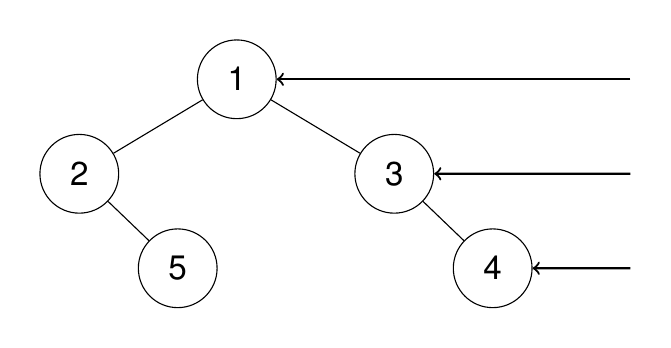

# Binary Tree Right Side View

https://leetcode.com/problems/binary-tree-right-side-view/description/

Given the `root` of a binary tree, imagine yourself standing on the **right side** of it, return *the values of the nodes you can see ordered from top to bottom*.

 

**Example 1:**

**Input:** root = [1,2,3,null,5,null,4]

**Output:** [1,3,4]

**Explanation:**



**Example 2:**

**Input:** root = [1,2,3,4,null,null,null,5]

**Output:** [1,3,4,5]

**Explanation:**


**Example 3:**

**Input:** root = [1,null,3]

**Output:** [1,3]

**Example 4:**

**Input:** root = []

**Output:** []

 

**Constraints:**

- The number of nodes in the tree is in the range `[0, 100]`.
- `-100 <= Node.val <= 100`


## Solution: BFS

```python
from collections import deque
class Solution:
    def rightSideView(self, root: Optional[TreeNode]) -> List[int]:
        if not root: return []

        dq = deque([root])
        res = []
        while dq:
            n = len(dq)
            res.append(dq[-1].val)
            for i in range(n):
                node = dq.popleft()
                if node.left:
                    dq.append(node.left)
                if node.right:
                    dq.append(node.right)
        return res
```

TC: O(n)

SC: O(n) worst case (n/2)